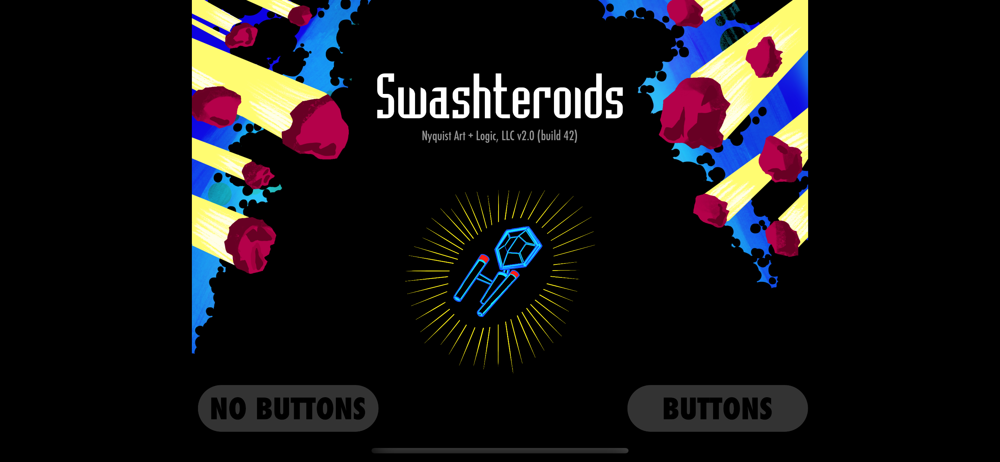

# Swash: An ECS framework for Swift

Swash is an entity systems component framework. The name "Swash" is a portmanteau of "Swift" and "Ash". Swash is a work-in-progress.

## ECS Warning... There be dragons here!
If you've not tried to implement anything with an ECS before, you might be in for a surprise. It is a different paradigm for solving problems. In an OOP world you're think of objects, but in an ECS you'll find it at times crazy fun and other times maddening because you're forced to solve a problem in an alien manner. It may be like your first time object-oriented programming if you were mostly experienced with procedural programming. 

## Process Overview
In Swash you will create entities. An `Entity` is an aggregate of components. A `Component` is like a object. Neither of these make the decisions, that's done in a `System` that acts on the components by way of nodes. Nodes hold references to components. You will define each `Node`, that describe the components from an entity that the system acts on. When you add an object to an `Engine`, the engine will see what nodes can be made from the entity based on its components.  

## Example
- A simple [project](https://github.com/johnrnyquist/SimpleSwashIntro) as an introduction to Swash.
- [Swashteroids](https://apps.apple.com/us/app/swashteroids/id6472061502) is an iPhone/iPad game made with Swash, or check out its [source code](https://github.com/johnrnyquist/Swashteroids) to get an idea on how to start writing your own. Here's a [video](https://www.youtube.com/watch?v=gP2bKw4NAHw) of the gameplay. Buy it in the App Store (only $0.99) to support development (mainly by encouraging the developer). 

## History
[Ash](https://github.com/richardlord/Ash) is an ActionScript 3 (AS3) framework that Swash was derived from. It was created by [Richard Lord](https://richardlord.net) to facilitate game development on the (now defunct) [Flash](https://www.adobe.com/products/flashplayer/end-of-life.html) platform.

AS3 is much more weakly typed than Swift, porting Ash to Swash was a technical challenge. I had at least one false start. Some aspects of the framework had to change (for example how you create a Node). I do not think any of my changes are unduly burdensome. At the very least, I think if you check out the code, you may see some interesting things done with Swift.

## Developer
- [John Nyquist](https://linkedin.com/in/nyquist)

## Thank You
- Swash is based on the brilliant [Ash](https://github.com/richardlord/Ash) framework by [Richard Lord](https://richardlord.net). 

## License
- This project is licensed under the MIT License - see the LICENSE.md file for details
