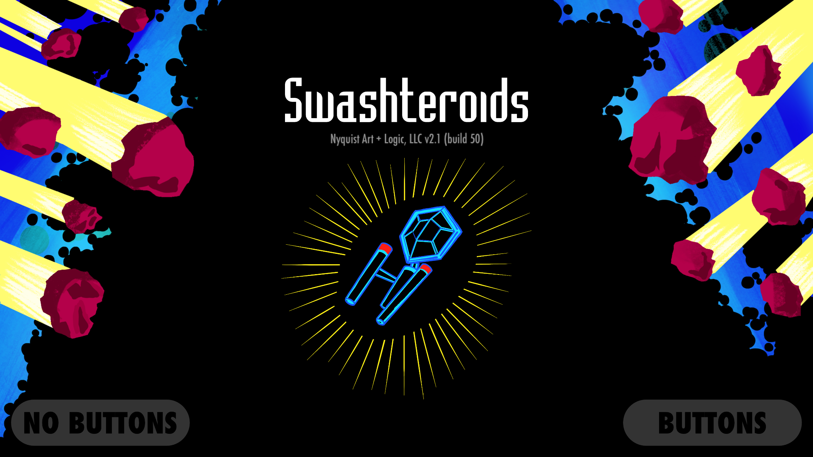

# Swash

A lightweight, fast Entity Component System framework for Swift.

Swash brings the ECS model from Ash into strongly typed Swift, with a small API surface and predictable runtime behavior. It powers real projects, including Swashteroids.

## Why Swash

- Built for game loops and real-time simulation
- Clean separation of data (Components) and behavior (Systems)
- Automatic entity-to-node matching via Engine + Family
- Small framework footprint, easy to reason about
- Battle-tested in a shipping iOS game

## What Is ECS (In Swash Terms)

- Entity: a container of components
- Component: plain data, no game logic
- Node: a typed view over required components
- System: logic that updates nodes each frame
- Engine: owns entities/systems and runs updates

If you are coming from OOP, ECS can feel unfamiliar at first. That is normal. Once it clicks, complex game behavior gets easier to scale and test.

## Installation (Swift Package Manager)

Add Swash to your `Package.swift` dependencies:

```swift
dependencies: [
	.package(url: "https://github.com/johnrnyquist/Swash.git", from: "1.0.0")
]
```

Then add Swash to your target dependencies:

```swift
.target(
	name: "YourGame",
	dependencies: ["Swash"]
)
```

## Quick Start

### 1) Define Components

```swift
import Swash

final class PositionComponent: Component {
	var x: Double
	var y: Double

	init(x: Double = 0, y: Double = 0) {
		self.x = x
		self.y = y
		super.init()
	}
}

final class VelocityComponent: Component {
	var dx: Double
	var dy: Double

	init(dx: Double = 0, dy: Double = 0) {
		self.dx = dx
		self.dy = dy
		super.init()
	}
}
```

### 2) Define a Node

A Node declares which components a System needs.

```swift
import Swash

final class MovementNode: Node {
	required init() {
		super.init()
		components = [
			PositionComponent.name: nil,
			VelocityComponent.name: nil,
		]
	}
}
```

### 3) Define a System

Use `ListIteratingSystem` when you want to iterate over matching nodes.

```swift
import Foundation
import Swash

final class MovementSystem: ListIteratingSystem {
	init() {
		super.init(nodeClass: MovementNode.self)
		nodeUpdateFunction = updateNode
	}

	private func updateNode(node: Node, time: TimeInterval) {
		guard let position = node[PositionComponent.self],
			  let velocity = node[VelocityComponent.self]
		else { return }

		position.x += velocity.dx * time
		position.y += velocity.dy * time
	}
}
```

### 4) Build and Run

```swift
import Swash

let engine = Engine(name: "main")

engine.add(system: MovementSystem(), priority: 10)

let player = Entity(named: "player")
	.add(component: PositionComponent(x: 0, y: 0))
	.add(component: VelocityComponent(dx: 100, dy: 0))

engine.add(entity: player)

// Typically called from your frame/tick provider.
engine.update(time: 1.0 / 60.0)
```

## Core API At A Glance

### Engine

- `add(entity:)`
- `remove(entity:)`
- `removeAllEntities()`
- `add(system:priority:)`
- `remove(system:)`
- `removeAllSystems()`
- `getNodeList(nodeClassType:)`
- `releaseNodeList(nodeClassName:)`
- `update(time:)`

### Entity

- `add(component:)`
- `remove(componentClass:)`
- `find(componentClass:)`
- `has(componentClass:)`
- `subscript(componentClass:)`
- `subscript(componentName:)`

### System lifecycle

- `addToEngine(engine:)`
- `update(time:)`
- `removeFromEngine(engine:)`

## Update Order and Priorities

Systems run in ascending priority order.

- Lower number = runs earlier
- Higher number = runs later

Example ordering:

- InputSystem priority 0
- MovementSystem priority 10
- CollisionSystem priority 20
- RenderPrepSystem priority 30

## Practical Notes

- Adding an `Entity` with a duplicate name replaces the existing one in `Engine`.
- Families and `NodeList` instances are created lazily when requested.
- `releaseNodeList` can free memory/resources when a list is no longer needed.
- During `Engine` updates, internal node pooling helps reduce churn.

## Example Projects

- Intro sample: https://github.com/johnrnyquist/SimpleSwashIntro
- Swashteroids demo: https://github.com/johnrnyquist/SwashteroidsDemo
- Swashteroids on App Store: https://apps.apple.com/us/app/swashteroids/id6472061502
- Gameplay video: https://www.youtube.com/watch?v=gP2bKw4NAHw



## Origins

Swash is inspired by the Ash ECS framework by Richard Lord, adapted to Swift's stronger type system.

- Ash: https://github.com/richardlord/Ash
- Richard Lord: https://richardlord.net

## Status

Swash is stable and in active use, with room to evolve.

If you are building something with it, open an issue or discussion and share what you are making.

## Author

John Nyquist  
https://linkedin.com/in/nyquist

## License

MIT  
See `LICENSE.md`
