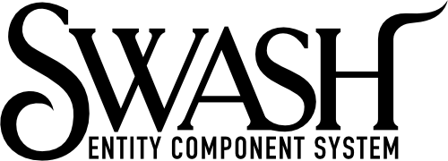

# Swash: An entity framework for Swift

#### Example
- [Swashteroids](https://github.com/johnrnyquist/Swashteroids)

#### Developer
- [John Nyquist](https://linkedin.com/in/nyquist)

#### Thank You
- Swash is based on the brilliant [Ash](https://github.com/richardlord/Ash) framework by [Richard Lord](https://richardlord.net). 

#### License
- This project is licensed under the MIT License - see the LICENSE.md file for details
